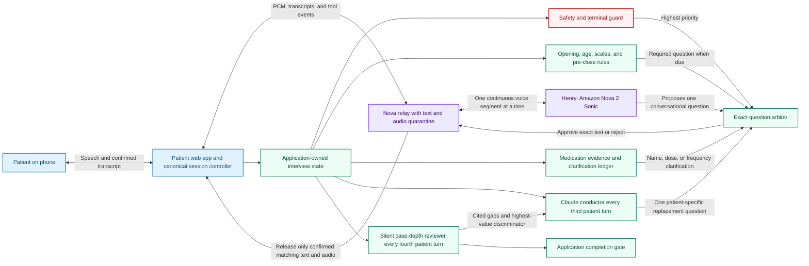
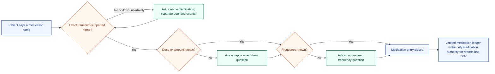
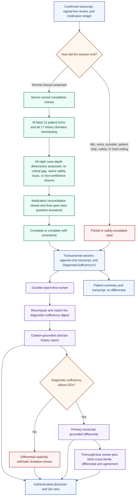

# Comprehensive Historian v4 — MVP Architecture

**Status:** Source candidate as of 2026-08-25. This diagram describes the intended isolated synthetic-QA implementation. It is not a claim of deployed acceptance, clinical validation, or autonomous diagnosis.

## The live interview

### The three AI roles

| Role | What it does | What it cannot do |
|---|---|---|
| **Henry — audible interviewer** | Conducts a natural voice conversation and proposes one question at a time. | Cannot make its own question audible until the application authorizes the exact wording. |
| **Claude conductor — intermittent question planner** | Uses the confirmed transcript and reviewer guidance to insert a case-specific, high-value neurologic question. | Does not speak directly, end the interview, or override safety and medication obligations. |
| **Silent case-depth reviewer — independent oversight role** | Audits transcript-cited coverage, contradictions, repetitions, medication evidence, safety, and eight case-depth dimensions. | Does not diagnose during the interview and cannot declare completion by itself. |

The eight depth dimensions are chief problem and goal; chronology and course; phenotype and severity; associated features and discriminators; functional impact; relevant history and risk; treatments and response; and prior evaluation. They are an internal evidence audit, not a patient-facing checklist.

### Medication behavior

- A symptom frequency cannot satisfy a medication-frequency question.
- An uncertain drug name is never silently corrected or presented as verified.
- Medication clarification has its own allowance, although every audible turn still counts toward the absolute 60-question safety ceiling.
- Unresolved medication information forces `complete_with_uncertainty` and a visible physician warning.

## Completion and post-session physician output

### Report and differential safeguards

- The clinician history report is generated first for complete and partial sessions. Its clinical claims must be exact patient-transcript quotes; a completed report must contain grounded claims in the core concern/timeline, symptom characterization, discriminators, functional impact, and prior evaluation/treatment sections. It is an organized extractive history, not free model prose.
- The report model receives a medication-redacted transcript. The application appends the verified medication ledger and explicit limitations afterward.
- The differential is physician/QA-only. It is generated only when the server-derived sufficiency artifact permits it; partial, shallow, unavailable-gate, and mismatched-digest sessions receive a deterministic withheld result.
- Both diagnostic model paths receive a medication-redacted transcript plus only the verified medication summary. Every displayed diagnosis must retain at least one exact quote from a patient turn; historian questions and redaction markers cannot ground a diagnosis.
- Free-form model rationale, synthesis prose, and model-authored ICD-10 codes are not persisted or displayed. Candidate names remain investigational, quote-linked suggestions for physician review.
- Comprehensive v3/v4 report import into a clinical note is disabled in both the UI and server route until role, tenant, visit, patient, and session binding plus a cited-report import contract are implemented.
- Differential likelihoods are uncalibrated investigational estimates, not confidence intervals, and require physician review against the transcript and chart.

## Current acceptance boundary

Source tests can prove deterministic orchestration, evidence binding, report-first ordering, DDx withholding, medication exactness, retry/idempotency, and UI states. They cannot prove deployed AWS behavior, natural Galaxy microphone endurance, interview quality, or clinical validity. Those remain separate QA and clinician-UAT gates.

## Source anchors

- Live orchestration and precedence: `src/hooks/useRealtimeSession.ts`
- Reviewer contract and app-owned closure: `src/lib/historian/liveReviewContract.ts`
- Medication ledger: `src/lib/historian/medicationReconciliation.ts`
- Exact audible turn admission: `services/nova-sonic-relay/src/server.ts`
- Server-derived sufficiency: `src/lib/historian/diagnosticSufficiency.ts`
- Invitation save boundary: `src/lib/historian/invitedSave.ts`
- Report-first worker: `src/workers/historianEvalWorker.ts`
- Citation-grounded report: `src/lib/historian/eval/clinicianHistoryReport.ts`
- Medication-safe diagnostic input: `src/lib/historian/eval/diagnosticInput.ts`
- Physician report and DDx surface: `src/components/HistorianSessionPanel.tsx`
